# NotionMate：透過Notion管理的Line推播平台

Cover: image/cover.jpg
Created time: May 14, 2023 3:01 PM
工具項目: Line API, Notion API, Python
應用項目: Line, Notion

# 動機

當我們使用Line平台進行溝通時，常常需要設定提醒、廣告推播等功能，以便更有效地管理我們的個人或工作生活。然而，對於那些經常使用Notion進行工作或任務管理的人來說，將這些功能整合到Notion上可能會更加方便和高效。因此，我開發了一個工具，可以讓使用者在Notion平台上設定和管理Line平台的訊息、提醒和廣告推播等功能，從而更加便捷地管理個人或工作事務。此外，這個工具還可以針對個人訊息、Line群組(教會小組)或廣告群組等不同的對象進行設定，從而提供更多的彈性和定制化選擇。總的來說，我開發這個工具的目的是為了讓使用者更好地管理自己的生活和工作，並提高效率和效益。

# Step 1 : 從Notion建立Table

依照下列動畫製作表單(Table)


# Step 2 : 建立資料

簡單建立三個表單資料，Date代表未來需要推播訊息的時間，Message代表推播訊息內容，Line group代表需要發送到的Line群組名稱，Tigger代表一個開關，Yes代表確定訊息內容了，時間到了就會傳送，反之就關閉

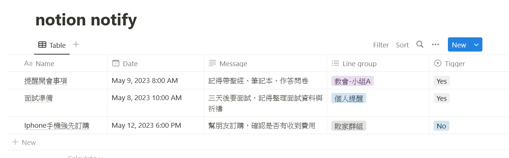

# Step 4 : 建立Connection

這裡非常重要，Notion要跟python做資料互相連接，就需要申請Token，此Token跟申請Line的方式很類似(後續會提到)，但是Notion是針對某個頁面做開啟Connection才可以做互相連接，此外那個Connection必須要做申請也就是Token申請，如圖下動畫開啟申請頁面


# Step 5 : Notion Token申請頁面

如紅色框，案開啟create new integration

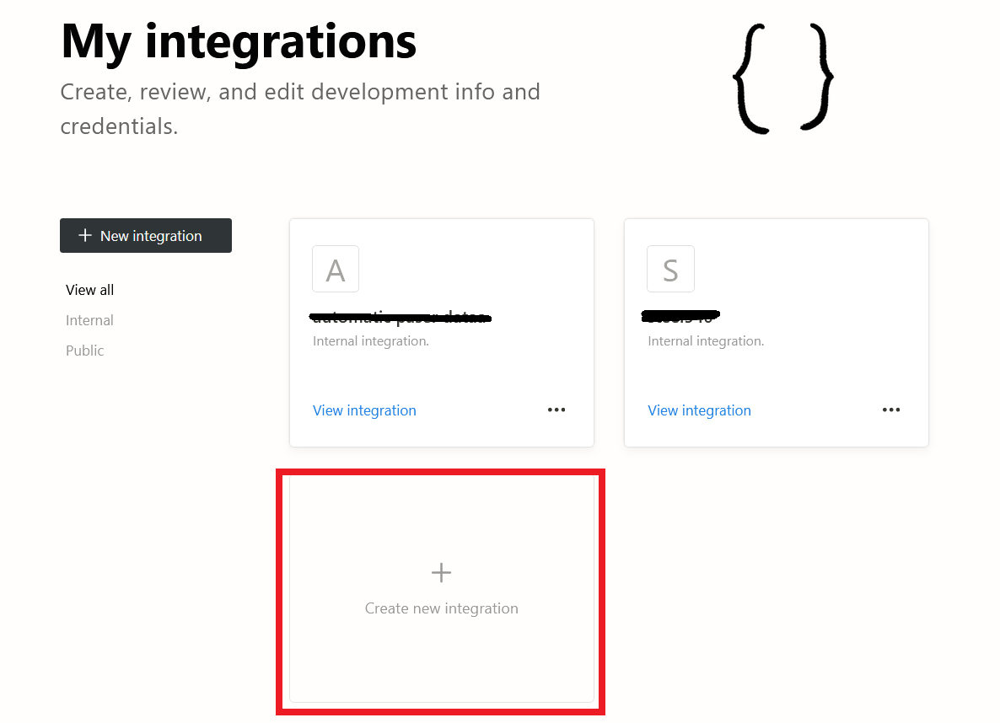

# Step 6 輸入申請資料

輸入名稱(Name)，此名稱可以隨意輸入但是要記得此名稱是未來對照Token(Connection)的名稱

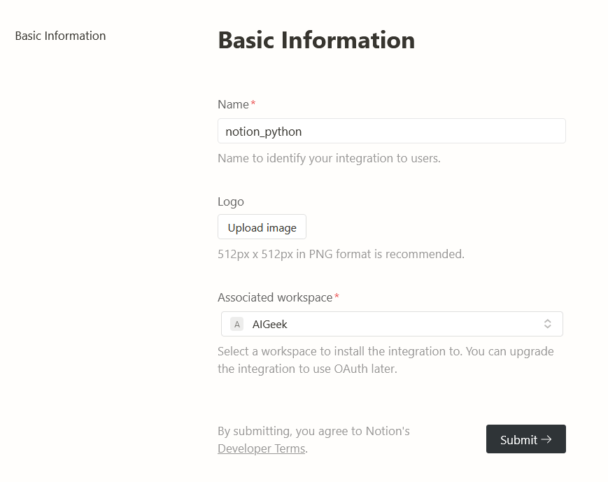

# Step 7 複製Token序號

這裡我輸入notion_python名稱當作Token序號，請把此序號記錄起來，等等python會需要使它當作連結驗證資訊

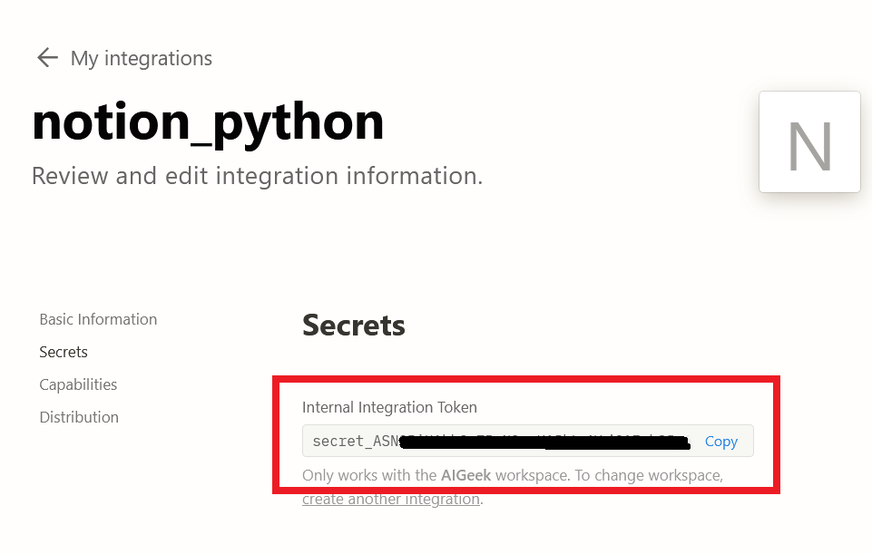

# Step 8 設定Notion連結頁面

把您剛剛建立好的頁面資訊做設定，這時候應就會有您剛剛設定的Coneection頁面名稱，我們connection名稱為notion_python

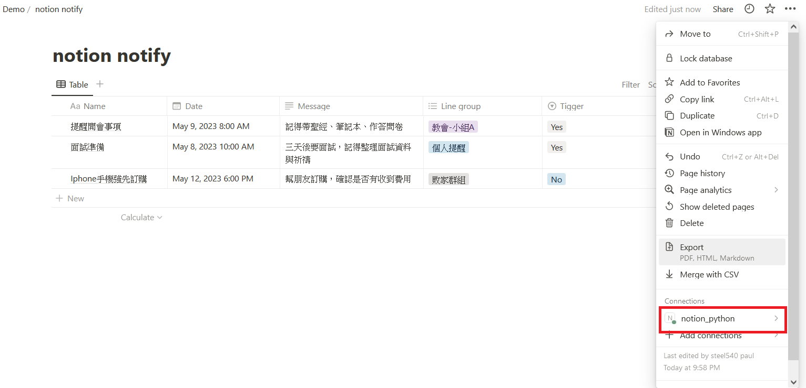

此外還有一個重點就是，除了輸入connection外，還要記錄您的database ID，如紅色字體內的字串為database ID

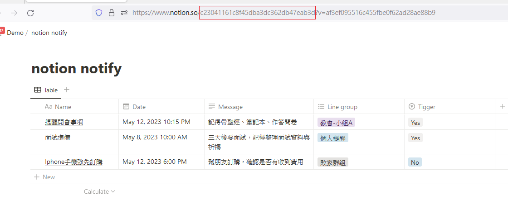

# Step 9 程式碼之範例

跟python做連接必須要有兩個資訊，1. token 2. database ID，這兩個資訊在上面步驟7與8已經提供如何取得，此時我的範例表單共有五個欄位，1. Aa 名稱(notion必備欄位)，2. Date，3. Text，4. Multi-select，5. Select，這些屬性名稱都對應到我以下的程式碼做資訊擷取，最後我再用Dataframe做資料儲存

```python
import pandas as pd
from notion_client import Client

# 設定 Notion API Token 和 Database ID
notion = Client(auth="secret_輸入您的Token")

database_id = "c23041161c8f45dba3dc362db47eab3d"
               
# 取得資料庫中的所有資料
results = notion.databases.query(database_id).get("results")

# 將 Notion 資料轉換成 Pandas DataFrame
data = []
for item in results:
    try:
        text = item["properties"]["Name"]["title"][0]["text"]["content"]
    except:
        text = None    
    try:
        date = item["properties"]["Date"]["date"]["start"]
    except:
        date = None    
    try:
        Message = item["properties"]["Message"]["rich_text"][0]["text"]["content"]
    except:
        Message = None
    try:
        Line_group = item["properties"]["Line group"]["multi_select"][0]["name"]
    except:
        Line_group = None
    try:
        Tigger = item["properties"]["Tigger"]["select"]["name"]
    except:
        Tigger = None        
    data.append([text, date, text, Message, Line_group, Tigger])

df = pd.DataFrame(data, columns=["Name", "Date", "video file", "Message", "Line group", "Tigger"])

# 儲存成 CSV 格式
df.to_csv('your_dataframe.csv', index=False)
```

結果，綠色是Notion上的頁面，紅色是python頁面(我的開發UI是spyder)

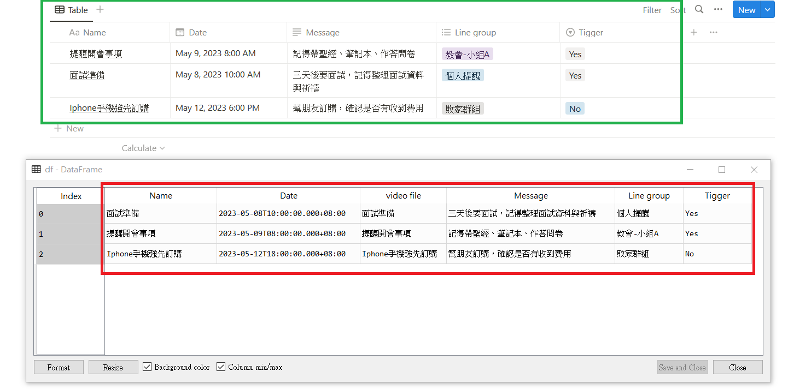

# Step 10 設定Line Notify權限(Token 申請)

我們需要藉由python方式做監控，當Notion設定的日期時間符合當下時間即時推播，所以必須申請Line Token權限，請先登入Line帳號後進行Line申請推播頁面，(這裡忽略Line申請帳號)

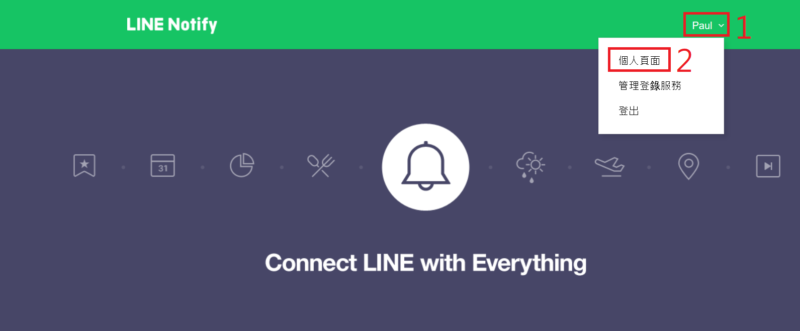

網址 : [https://notify-bot.line.me/zh_TW/](https://notify-bot.line.me/zh_TW/)

# Step 11

點選發行權杖

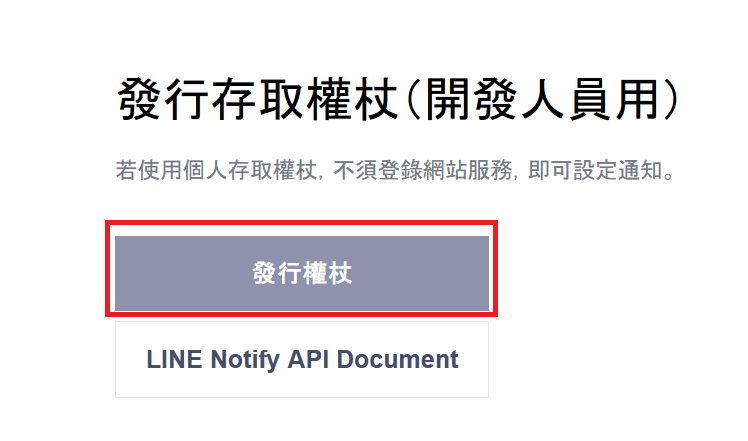

# Step 12

一樣輸入申請Token名稱，這裡命名為pyton_test，然後再點選你要提醒的Line群組

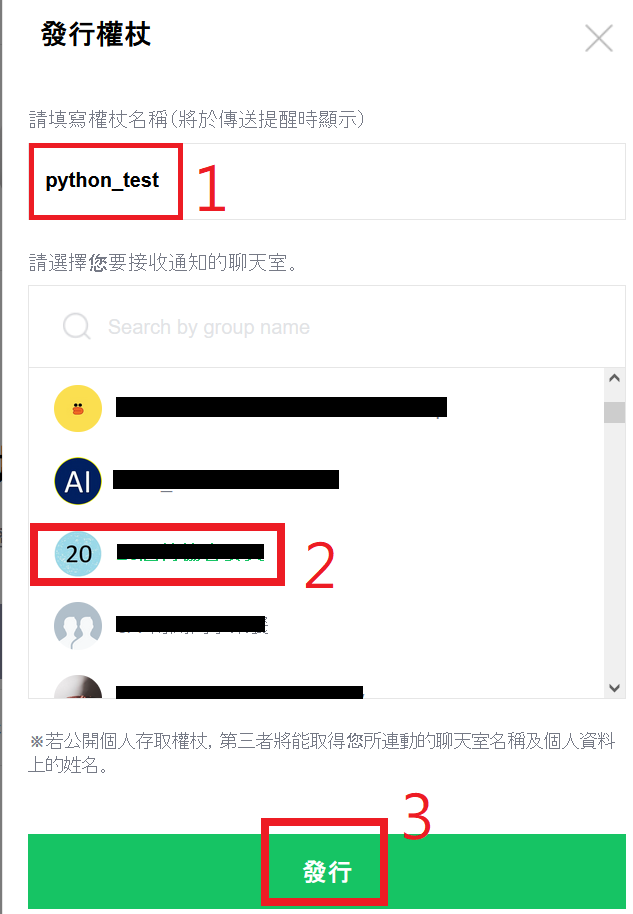

# Step 13

複製您的Line Token序號

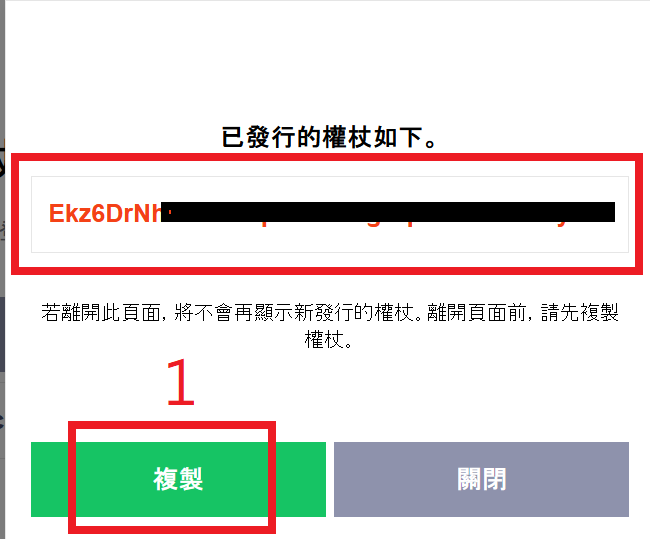

回到Line Notify頁面應該就會看到您剛剛建立的service

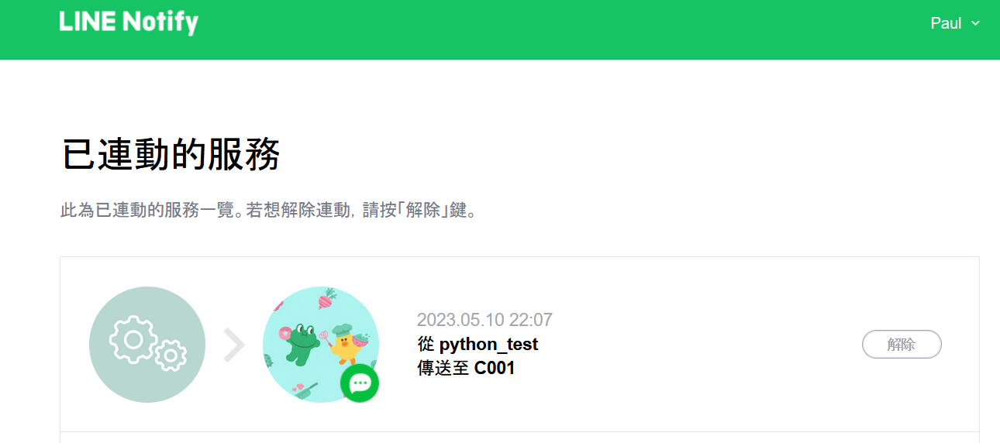

# Step 14 設定Notify機器人

請使用手機(比較方便)點選你剛剛需要推播的群組，點選加入人員後再收尋頁面打”line”，就可以看到我截圖畫面，把LINE Notify機器人放在群組內

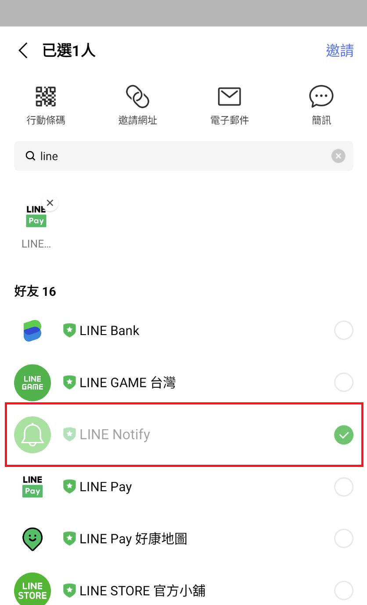

# Step 15 測試Line Notify

下列程式碼可以讓您簡單測試Line與pyton之間相連結，基本上範例code您只需要輸入Line token及訊息您可以隨意輸入

```python
#基本功能測試
import requests

def lineNotifyMessage(token, msg):

    headers = {
        "Authorization": "Bearer " + token, 
        "Content-Type" : "application/x-www-form-urlencoded"
    }

    payload = {'message': msg }
    r = requests.post("https://notify-api.line.me/api/notify", headers = headers, params = payload)
    return r.status_code

if __name__ == "__main__":
  token = '您的Line Token'
  message = '基本功能測試'
  lineNotifyMessage(token, message)
```

當您輸入完後啟動執行程式碼，就可以看到以下畫面，Notify就會主動推播訊息

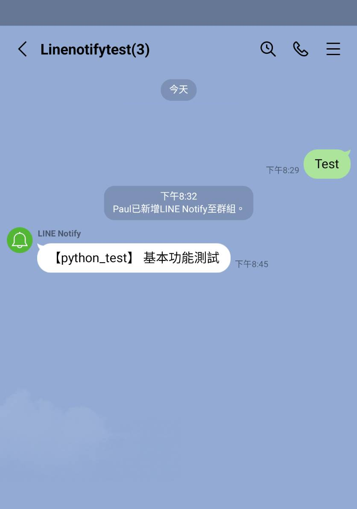

# Step 16

再來就是整個code的整合，我們先觀察一下，我在notion的第一筆資料輸入2023-05-12當天的晚上10:15做提醒，並且只在教會-小組A做推播

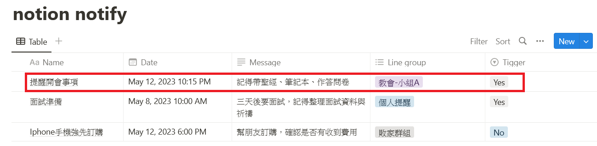

然後以下code就是overall的監控推播代碼

```python
# -*- coding: utf-8 -*-
"""
Created on Fri May 12 21:54:38 2023

@author: User
"""

import requests
import pandas as pd
from notion_client import Client
import time
from datetime import datetime

# notion information
database_id  = "c23041161c8f45dba3dc362db47eab3d" # notion table page
notion_token = "secret_輸入您的Notion Token" # notion connection token
Line_token   = "輸入您的Line Token"

def lineNotifyMessage(Line_token, msg):

    headers = {
        "Authorization": "Bearer " + Line_token, 
        "Content-Type" : "application/x-www-form-urlencoded"
    }

    payload = {'message': msg }
    r = requests.post("https://notify-api.line.me/api/notify", headers = headers, params = payload)
    return r.status_code

def getnotiontable(database_id, notion_token):
    # 設定 Notion API Token 和 Database ID
    notion = Client(auth=notion_token)
    
    
                   
    # 取得資料庫中的所有資料
    results = notion.databases.query(database_id).get("results")
    
    # 將 Notion 資料轉換成 Pandas DataFrame
    data = []
    for item in results:
        try:
            text = item["properties"]["Name"]["title"][0]["text"]["content"]
        except:
            text = None    
        try:
            date = item["properties"]["Date"]["date"]["start"]
        except:
            date = None    
        try:
            Message = item["properties"]["Message"]["rich_text"][0]["text"]["content"]
        except:
            Message = None
        try:
            Line_group = item["properties"]["Line group"]["multi_select"][0]["name"]
        except:
            Line_group = None
        try:
            Tigger = item["properties"]["Tigger"]["select"]["name"]
        except:
            Tigger = None        
        data.append([text, date, text, Message, Line_group, Tigger])
    
    df = pd.DataFrame(data, columns=["Name", "Date", "video file", "Message", "Line group", "Tigger"])
    
    return df

if __name__ == "__main__":

    # 讀取DataFrame資料
    df = getnotiontable(database_id, notion_token)
    print(df)
    # 設定監控頻率
    monitor_interval = 60  # 每一分鐘檢查一次
    
    while True:
        # 取得目前時間，並轉換為與行程時間相同的格式
        current_time = datetime.now().strftime('%Y-%m-%d %H:%M')
        
        # 搜尋是否有任何行程需要啟動
        for index, row in df.iterrows():
            scheduled_time = datetime.strptime(row['Date'][:19], '%Y-%m-%dT%H:%M:%S').strftime('%Y-%m-%d %H:%M')
            print('scheduled_time :', scheduled_time)
            print('current_time :', current_time)
            if scheduled_time == current_time:
                print('時間符合')
                if row['Tigger'] == 'Yes':
                    print('啟動推播')
                    lineNotifyMessage(Line_token, row['Message'])
                    
        # 休息一段時間再進行下一次監控
        print('sleep')
        time.sleep(monitor_interval)
        # update notion table information
        df = getnotiontable(database_id, notion_token)
        print(df)
```

可以看到監控代碼發現當下時間與Notion設定日期時間相符後，且是允許被推播的後就會完成訊息推播，如下結果

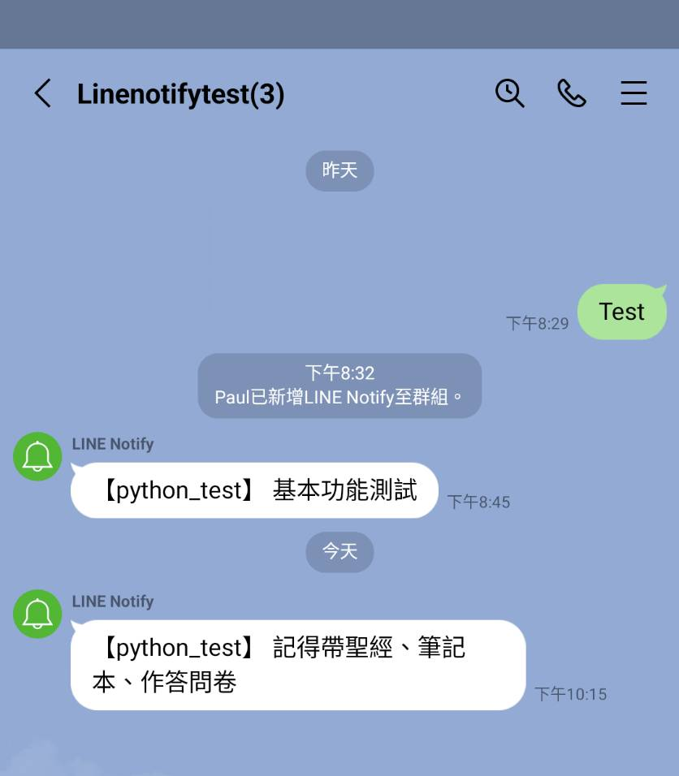

# 結論

經過以上幾個步驟，我們成功地建立了一個透過Notion管理的Line推播平台。我們使用Python與Notion API來監聽Notion中的資料，並當資料符合設定的日期時間時，透過Line Notify機器人發送訊息提醒。這個平台能夠應用在各種場合，例如提醒行事曆、跟蹤工作流程等等。此外，透過Notion的資料庫管理功能，我們可以更方便地進行資料統整，並透過API來取得資料，避免手動整理資料的麻煩。
